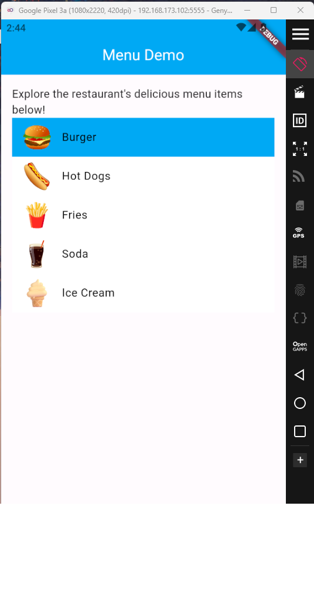
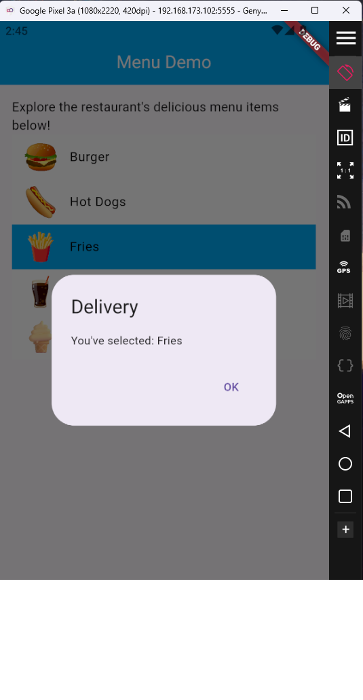
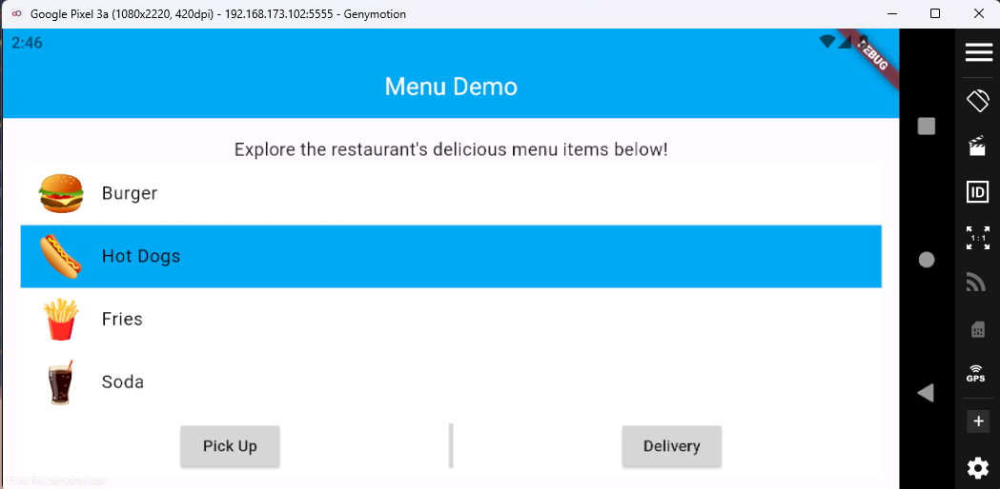

# Menu Demo

- Alineaciones y estilos 
- Alert Dialogs
- Assets

## Lo que me costó más trabajo
- Definir los Assets
- Uso del List View Builder

## Lo que aprendí
- Uso de propiedades de widgets
- Agregar mis imagenes
- Crear alertas
- Alterar textos

## Descripción de la App
Esta app es una demo para mostrar cómo se ppdría ver un menu que implenta Pick Up y Delivery. Perimte seleccionar una opción que se verá refeljada cambiando de color y al seleccionar un botón.

## Screenshots

## Referencias

Vertical Divider not showing. (s. f.). Stack Overflow. https://stackoverflow.com/questions/59960153/vertical-divider-not-showing
ButtonStyle class - material library - Dart API. (s. f.). https://api.flutter.dev/flutter/material/ButtonStyle-class.html
AlertDialog class - material library - Dart API. (s. f.). https://api.flutter.dev/flutter/material/AlertDialog-class.html
Adding assets and images. (s. f.). Flutter. https://docs.flutter.dev/ui/assets/assets-and-images
How to make an AlertDialog in Flutter? (s. f.). Stack Overflow. https://stackoverflow.com/questions/53844052/how-to-make-an-alertdialog-in-flutter
